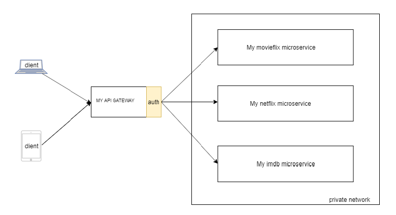
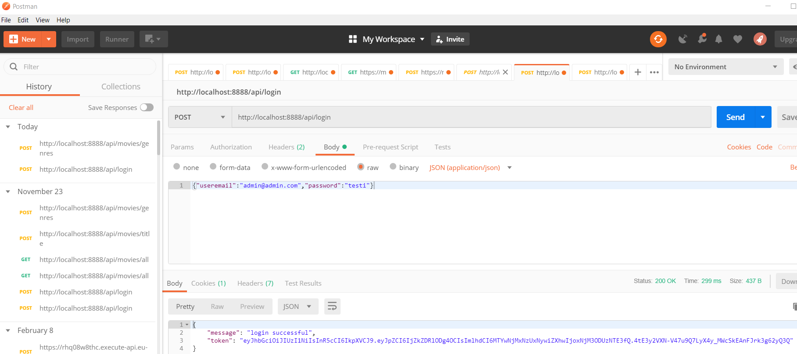

# My Movie FLIX 

## What is MY Movie FLIX?
MY FLIX a movie suggestion microservice application. User can get the movies by genres.

My Flix has a My API gateway.Its an API gateway.Its entry point to the microservices.API gateway runs in public server.Microservices runs in private networks.
API gateway take care of API routing to microservices and User authentication.

### Setup and running

## To run the my-api-gateway
- Clone / Download the project
- yarn 
- yarn start 
- my api gateway listen the port 8888. 
- API documents http://localhost:8888/api-docs/ . refer movieMyFlixSuggestionService.js file for endpoint informations
  
## To run the microservices
- got to each service(my-movieflix-service, my-movie-imdb-service, my-movieNetflix-service)
- yarn 
- yarn start

## Example steps to fetch movies from microservices using postman
- login to http://localhost:8888/api/login username:admin@admin.com  password: testi  
   copy the response token
  
- Call movie api example  http://localhost:8888/api/movies/genres with authorization token
  

